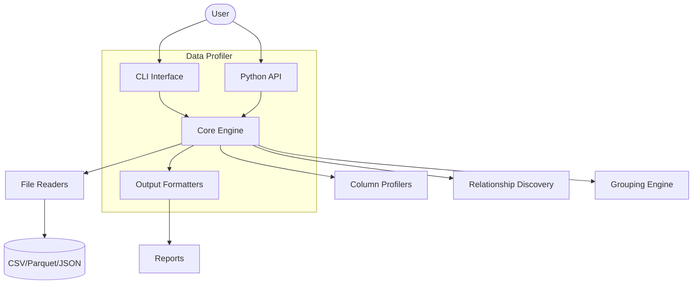
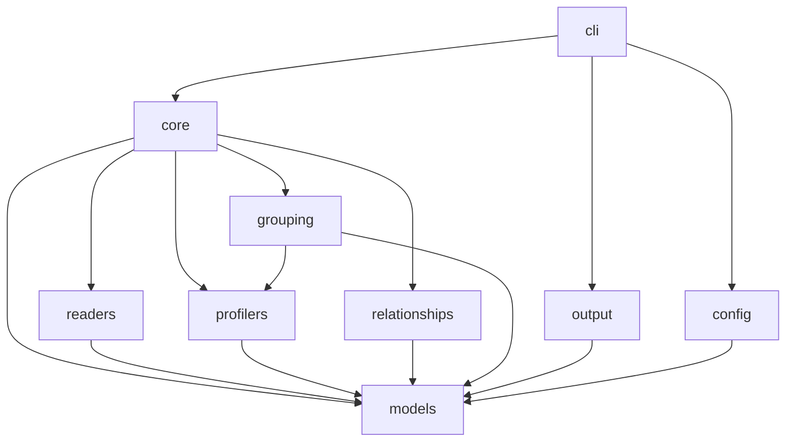
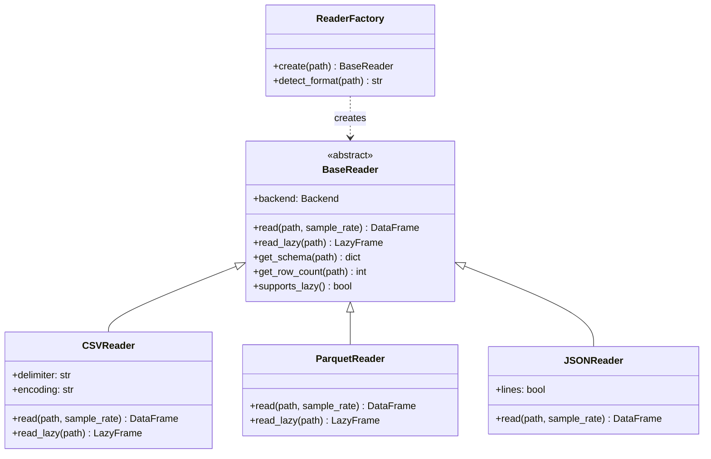
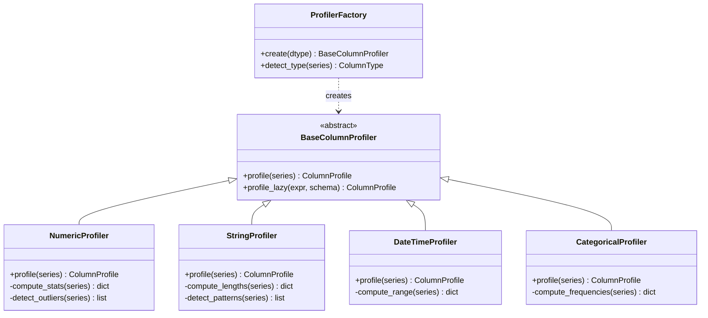
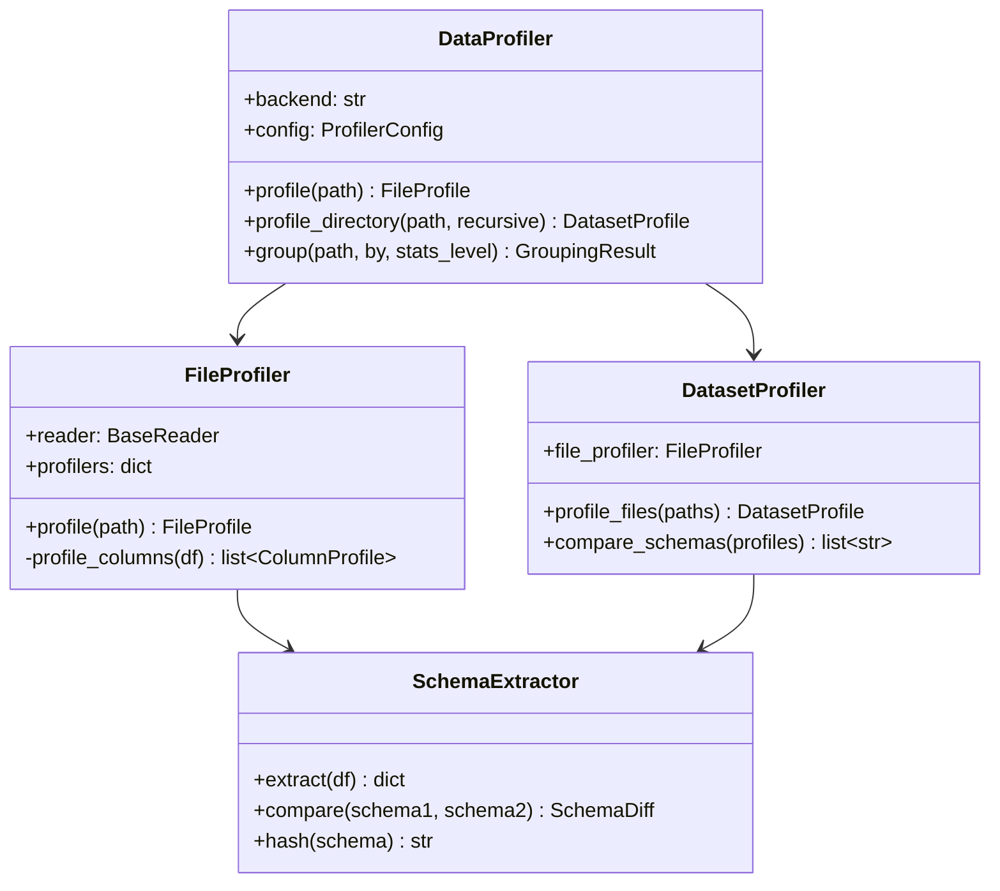
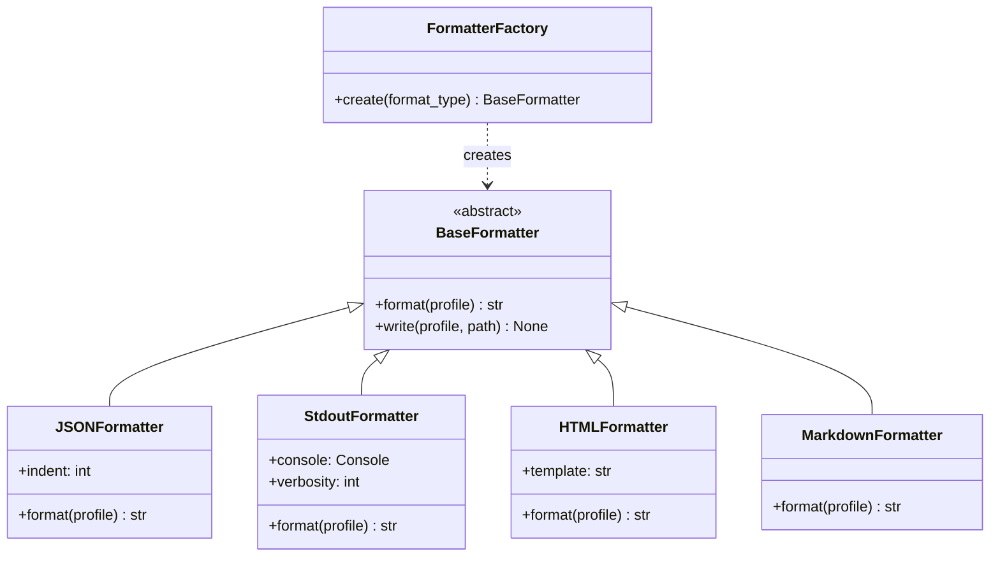
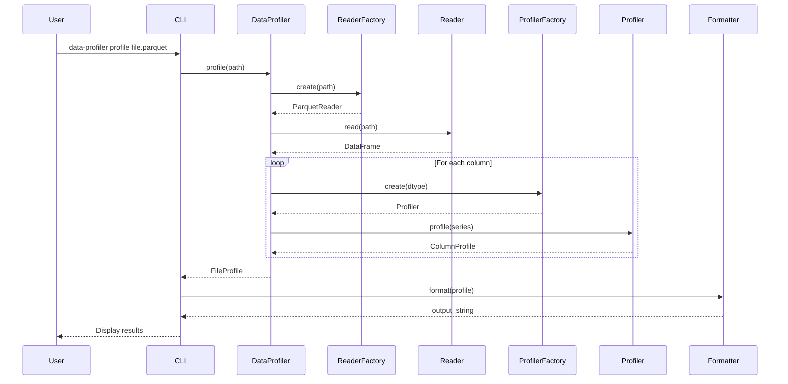
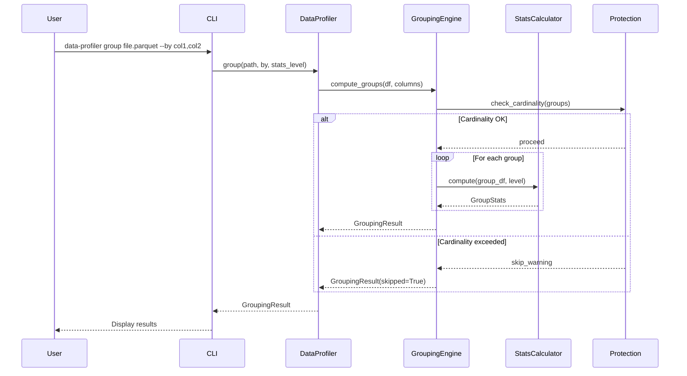
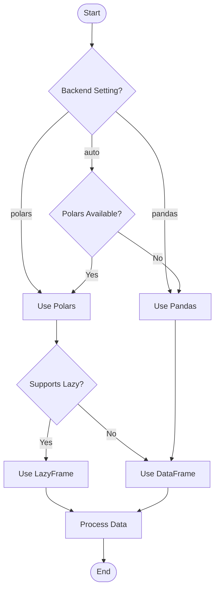
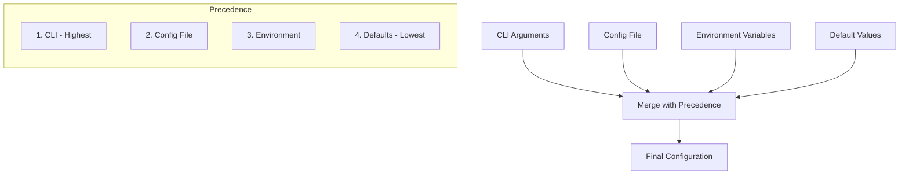

# Data Profiler - Technical Design Document

**Version:** 1.2.0
**Created:** 2024-11-30
**Status:** Phase 6 Complete - Feature Complete

---

## Table of Contents

1. [Architecture Overview](#1-architecture-overview)
2. [Module Architecture](#2-module-architecture)
3. [Class Hierarchy](#3-class-hierarchy)
4. [Data Flow](#4-data-flow)
5. [Interface Contracts](#5-interface-contracts)
6. [Error Handling](#6-error-handling)
7. [Configuration](#7-configuration)

---

## 1. Architecture Overview

### 1.1 System Context



### 1.2 Design Principles

| Principle | Implementation |
|-----------|----------------|
| **Backend Agnostic** | Polars preferred, Pandas fallback |
| **Type-based Detection** | Check actual object type, not global backend setting |
| **Lazy Evaluation** | Use Polars LazyFrame where possible |
| **Composition** | Small, focused components |
| **Configuration Precedence** | CLI > Config file > Env > Defaults |
| **Fail Fast** | Validate inputs early, clear error messages |

### 1.3 Technology Stack

| Component | Primary | Fallback |
|-----------|---------|----------|
| DataFrame | Polars | Pandas |
| Parquet | PyArrow | - |
| CLI | argparse | - |
| Console Output | Rich | print() |
| HTML Reports | Custom | ydata-profiling |
| Graphs | networkx | - |

---

## 2. Module Architecture

### 2.1 Package Structure

```
src/data_profiler/
├── __init__.py          # Public API exports
├── py.typed             # PEP 561 marker
│
├── cli/                 # Command-line interface
│   ├── __init__.py
│   ├── main.py          # Entry point, argument parsing
│   └── common.py        # Exit codes, output helpers
│
├── models/              # Data transfer objects
│   ├── __init__.py
│   ├── profile.py       # ColumnProfile, FileProfile, DatasetProfile
│   ├── grouping.py      # GroupStats, GroupingResult
│   └── relationships.py # Entity, Relationship, RelationshipGraph
│
├── readers/             # File I/O abstraction
│   ├── __init__.py
│   ├── base.py          # BaseReader ABC
│   ├── backend.py       # Backend selection (Polars/Pandas)
│   ├── csv_reader.py    # CSV support
│   ├── parquet_reader.py# Parquet support
│   ├── json_reader.py   # JSON/JSONL support
│   └── factory.py       # Reader factory
│
├── profilers/           # Column-level profiling
│   ├── __init__.py
│   ├── base.py          # BaseColumnProfiler ABC
│   ├── numeric.py       # Numeric column profiling
│   ├── string.py        # String column profiling
│   ├── datetime.py      # DateTime column profiling
│   ├── categorical.py   # Categorical column profiling
│   └── factory.py       # Profiler factory
│
├── core/                # Core profiling engine
│   ├── __init__.py
│   ├── profiler.py      # DataProfiler main class
│   ├── file_profiler.py # Single file profiling
│   ├── dataset_profiler.py # Multi-file profiling
│   └── schema.py        # Schema extraction/comparison
│
├── relationships/       # FK/relationship discovery
│   ├── __init__.py
│   ├── detector.py      # FK candidate detection
│   ├── hints.py         # Hint file parser
│   ├── graph.py         # Entity graph builder
│   └── patterns.py      # Naming conventions
│
├── grouping/            # Grouped aggregations
│   ├── __init__.py
│   ├── engine.py        # Group-by computation
│   ├── stats.py         # Per-group statistics
│   ├── cross_file.py    # Cross-file grouping
│   └── protection.py    # Cardinality protection
│
├── output/              # Output formatters
│   ├── __init__.py
│   ├── base.py          # BaseFormatter ABC
│   ├── json_formatter.py
│   ├── stdout_formatter.py
│   ├── html_formatter.py
│   ├── html_ydata.py    # ydata-profiling wrapper
│   └── markdown_formatter.py
│
└── config/              # Configuration handling
    ├── __init__.py
    ├── loader.py        # Config file parser
    ├── schema.py        # Config validation
    └── precedence.py    # CLI > config precedence
```

### 2.2 Module Dependencies



**Dependency Rules:**
- `models` has no internal dependencies (leaf module)
- `readers` depends only on `models`
- `profilers` depends only on `models`
- `core` orchestrates all modules
- `cli` is the top-level entry point

---

## 3. Class Hierarchy

### 3.1 Reader Classes



### 3.2 Profiler Classes



### 3.3 Core Classes



### 3.4 Output Classes



---

## 4. Data Flow

### 4.1 Single File Profiling



### 4.2 Grouped Analysis



### 4.3 Backend Selection Flow



### 4.4 Type Detection Pattern (Critical)

**Problem:** Global backend setting (`set_backend("pandas")`) can cause test pollution
where Polars DataFrames are processed with Pandas API calls.

**Solution:** Check actual object type, not global backend setting.

```python
# In readers/backend.py

def is_polars_series(series: Any) -> bool:
    """Check if a Series is a Polars Series.

    This checks the actual object type, NOT the global backend setting.
    """
    return type(series).__module__.startswith("polars")

def is_polars_dataframe(df: Any) -> bool:
    """Check if a DataFrame is a Polars DataFrame.

    This checks the actual object type, NOT the global backend setting.
    """
    return type(df).__module__.startswith("polars")

def reset_backend() -> None:
    """Reset the backend to auto-detect mode.

    Used in test fixtures to prevent state pollution.
    """
    global _current_backend
    _current_backend = None
```

**Usage in Profilers:**

```python
# In profilers/base.py, numeric.py, string.py, datetime.py, categorical.py

def _get_basic_stats(self, series: Any, name: str) -> ColumnProfile:
    # Check actual series type, not global backend setting
    if is_polars_series(series):
        return self._get_basic_stats_polars(series, name)
    else:
        return self._get_basic_stats_pandas(series, name)
```

**Test Fixture:**

```python
# In tests/conftest.py

@pytest.fixture(autouse=True)
def reset_backend_after_test():
    """Reset backend to auto-detect mode after each test."""
    yield  # Let test run
    from data_profiler.readers.backend import reset_backend
    reset_backend()
```

---

## 5. Interface Contracts

### 5.1 BaseReader Interface

```python
from abc import ABC, abstractmethod
from pathlib import Path
from typing import Any

class BaseReader(ABC):
    """Abstract base class for file readers.

    All readers must implement read() and get_schema().
    Lazy evaluation (read_lazy) is optional and backend-dependent.
    """

    def __init__(self, backend: "Backend") -> None:
        """Initialize reader with backend.

        Args:
            backend: Backend instance for DataFrame operations.
        """
        self.backend = backend

    @abstractmethod
    def read(
        self,
        path: Path,
        sample_rate: float | None = None,
        columns: list[str] | None = None,
    ) -> Any:  # DataFrame (Polars or Pandas)
        """Read file into DataFrame.

        Args:
            path: Path to file.
            sample_rate: Optional sampling rate (0.0-1.0).
            columns: Optional list of columns to read.

        Returns:
            DataFrame with file contents.

        Raises:
            FileNotFoundError: If path does not exist.
            ValueError: If file format is invalid.
        """
        ...

    def read_lazy(self, path: Path) -> Any:  # LazyFrame (Polars only)
        """Read file as lazy frame (Polars only).

        Args:
            path: Path to file.

        Returns:
            LazyFrame for deferred computation.

        Raises:
            NotImplementedError: If backend doesn't support lazy evaluation.
        """
        raise NotImplementedError("Lazy evaluation not supported")

    @abstractmethod
    def get_schema(self, path: Path) -> dict[str, str]:
        """Extract schema from file without reading all data.

        Args:
            path: Path to file.

        Returns:
            Dict mapping column names to type strings.
        """
        ...

    @abstractmethod
    def get_row_count(self, path: Path) -> int:
        """Get row count without reading all data.

        Args:
            path: Path to file.

        Returns:
            Number of rows in file.
        """
        ...

    def supports_lazy(self) -> bool:
        """Check if reader supports lazy evaluation.

        Returns:
            True if read_lazy() is implemented.
        """
        return False
```

### 5.2 BaseColumnProfiler Interface

```python
from abc import ABC, abstractmethod
from typing import Any

from data_profiler.models import ColumnProfile, ColumnType

class BaseColumnProfiler(ABC):
    """Abstract base class for column profilers.

    Each profiler specializes in a specific data type and computes
    relevant statistics for that type.
    """

    @property
    @abstractmethod
    def supported_types(self) -> list[ColumnType]:
        """List of column types this profiler handles."""
        ...

    @abstractmethod
    def profile(self, series: Any, column_name: str) -> ColumnProfile:
        """Profile a column/series.

        Args:
            series: Pandas Series or Polars Series.
            column_name: Name of the column.

        Returns:
            ColumnProfile with computed statistics.
        """
        ...

    def can_profile(self, dtype: ColumnType) -> bool:
        """Check if this profiler handles the given type.

        Args:
            dtype: Column data type.

        Returns:
            True if profiler can handle this type.
        """
        return dtype in self.supported_types
```

### 5.3 BaseFormatter Interface

```python
from abc import ABC, abstractmethod
from pathlib import Path
from typing import Union

from data_profiler.models import FileProfile, DatasetProfile, GroupingResult

ProfileType = Union[FileProfile, DatasetProfile, GroupingResult]

class BaseFormatter(ABC):
    """Abstract base class for output formatters."""

    @abstractmethod
    def format(self, profile: ProfileType) -> str:
        """Format profile as string.

        Args:
            profile: Profile result to format.

        Returns:
            Formatted string representation.
        """
        ...

    def write(self, profile: ProfileType, path: Path) -> None:
        """Write formatted profile to file.

        Args:
            profile: Profile result to write.
            path: Output file path.
        """
        content = self.format(profile)
        path.write_text(content, encoding="utf-8")
```

### 5.4 DataProfiler Interface

```python
from pathlib import Path
from typing import Literal

from data_profiler.models import (
    FileProfile,
    DatasetProfile,
    GroupingResult,
    StatsLevel,
)

class DataProfiler:
    """Main entry point for data profiling operations."""

    def __init__(
        self,
        backend: Literal["auto", "polars", "pandas"] = "auto",
        config_path: Path | None = None,
    ) -> None:
        """Initialize profiler.

        Args:
            backend: DataFrame backend to use.
            config_path: Optional path to config file.
        """
        ...

    def profile(
        self,
        path: str | Path,
        columns: list[str] | None = None,
        sample_rate: float | None = None,
    ) -> FileProfile:
        """Profile a single file.

        Args:
            path: Path to data file.
            columns: Optional list of columns to profile.
            sample_rate: Optional sampling rate (0.0-1.0).

        Returns:
            FileProfile with profiling results.
        """
        ...

    def profile_directory(
        self,
        path: str | Path,
        recursive: bool = False,
        pattern: str = "*",
    ) -> DatasetProfile:
        """Profile all files in a directory.

        Args:
            path: Directory path.
            recursive: Whether to scan subdirectories.
            pattern: Glob pattern for file matching.

        Returns:
            DatasetProfile with aggregated results.
        """
        ...

    def group(
        self,
        path: str | Path,
        by: list[str],
        stats_level: StatsLevel = StatsLevel.COUNT,
        max_groups: int = 10,
    ) -> GroupingResult:
        """Compute grouped row counts.

        Args:
            path: Path to data file.
            by: Columns to group by.
            stats_level: Level of statistics to compute.
            max_groups: Maximum groups before warning/skip.

        Returns:
            GroupingResult with per-group statistics.
        """
        ...
```

---

## 6. Error Handling

### 6.1 Exception Hierarchy

```python
class DataProfilerError(Exception):
    """Base exception for all data-profiler errors."""
    pass

class FileError(DataProfilerError):
    """File-related errors."""
    pass

class FileNotFoundError(FileError):
    """File does not exist."""
    pass

class UnsupportedFormatError(FileError):
    """File format not supported."""
    pass

class SchemaError(DataProfilerError):
    """Schema-related errors."""
    pass

class SchemaDriftError(SchemaError):
    """Schema mismatch between files."""
    pass

class ConfigError(DataProfilerError):
    """Configuration errors."""
    pass

class BackendError(DataProfilerError):
    """Backend-related errors."""
    pass

class BackendNotAvailableError(BackendError):
    """Requested backend not installed."""
    pass
```

### 6.2 Error Handling Strategy

| Scenario | Behavior | Exit Code |
|----------|----------|-----------|
| File not found | Error message, continue to next file | 10 |
| Unsupported format | Error message, skip file | 11 |
| Schema drift (strict) | Error, stop processing | 12 |
| Schema drift (warn) | Warning, continue | 0 |
| Cardinality exceeded | Warning, skip grouping | 13 |
| Backend not available | Fallback to Pandas | 0 |
| Config file invalid | Error, use defaults | 2 |

### 6.3 Logging Strategy

```python
import logging

# Module-level logger
logger = logging.getLogger("data_profiler")

# Log levels by category
# DEBUG: Detailed internal state
# INFO: Progress updates
# WARNING: Non-fatal issues (schema drift, cardinality)
# ERROR: Fatal issues that stop processing
```

---

## 7. Configuration

### 7.1 Configuration Schema

```json
{
  "$schema": "http://json-schema.org/draft-07/schema#",
  "type": "object",
  "properties": {
    "backend": {
      "type": "string",
      "enum": ["auto", "polars", "pandas"],
      "default": "auto"
    },
    "input": {
      "type": "object",
      "properties": {
        "files": {"type": "array", "items": {"type": "string"}},
        "directories": {"type": "array", "items": {"type": "string"}},
        "recursive": {"type": "boolean", "default": false},
        "file_types": {
          "type": "array",
          "items": {"type": "string", "enum": ["csv", "parquet", "json"]},
          "default": ["csv", "parquet", "json"]
        }
      }
    },
    "profiling": {
      "type": "object",
      "properties": {
        "columns": {"type": "array", "items": {"type": "string"}},
        "sample_rate": {"type": "number", "minimum": 0, "maximum": 1},
        "relationships": {"type": "boolean", "default": false},
        "schema_drift": {
          "type": "string",
          "enum": ["strict", "warn", "ignore"],
          "default": "strict"
        }
      }
    },
    "grouping": {
      "type": "object",
      "properties": {
        "columns": {"type": "array", "items": {"type": "string"}},
        "stats_level": {
          "type": "string",
          "enum": ["count", "basic", "full"],
          "default": "count"
        },
        "max_groups": {"type": "integer", "default": 10},
        "cross_file": {"type": "boolean", "default": false}
      }
    },
    "output": {
      "type": "object",
      "properties": {
        "format": {
          "type": "array",
          "items": {"type": "string", "enum": ["json", "html", "markdown", "stdout"]},
          "default": ["stdout"]
        },
        "directory": {"type": "string"},
        "html_engine": {
          "type": "string",
          "enum": ["custom", "ydata"],
          "default": "custom"
        },
        "verbosity": {"type": "integer", "minimum": 0, "maximum": 3, "default": 1}
      }
    }
  }
}
```

### 7.2 Configuration Precedence



### 7.3 Environment Variables

| Variable | Description | Default |
|----------|-------------|---------|
| `DATA_PROFILER_BACKEND` | Default backend | `auto` |
| `DATA_PROFILER_CONFIG` | Config file path | None |
| `DATA_PROFILER_VERBOSITY` | Output verbosity | `1` |
| `DATA_PROFILER_LOG_LEVEL` | Logging level | `WARNING` |

---

## Appendix A: Polars vs Pandas Comparison

| Feature | Polars | Pandas |
|---------|--------|--------|
| Lazy evaluation | Yes | No |
| Multi-threading | Built-in | Limited |
| Memory efficiency | Better | Good |
| API stability | Newer | Mature |
| Ecosystem | Growing | Extensive |

**Decision:** Use Polars when available, fall back to Pandas for compatibility.

---

## Appendix B: Performance Considerations

### Memory Management

1. **Large Files:** Use sampling or lazy evaluation
2. **Multiple Files:** Process sequentially, aggregate results
3. **Grouping:** Check cardinality before computation

### Optimization Points

1. **Schema extraction:** Read metadata only, not full data
2. **Row counts:** Use file metadata when available
3. **Column profiling:** Parallelize across columns
4. **Lazy evaluation:** Defer computation until needed

---

## Document History

| Version | Date | Changes |
|---------|------|---------|
| 1.0.0 | 2024-11-30 | Initial design document |
| 1.1.0 | 2024-11-30 | Added Type Detection Pattern (4.4); updated design principles |
